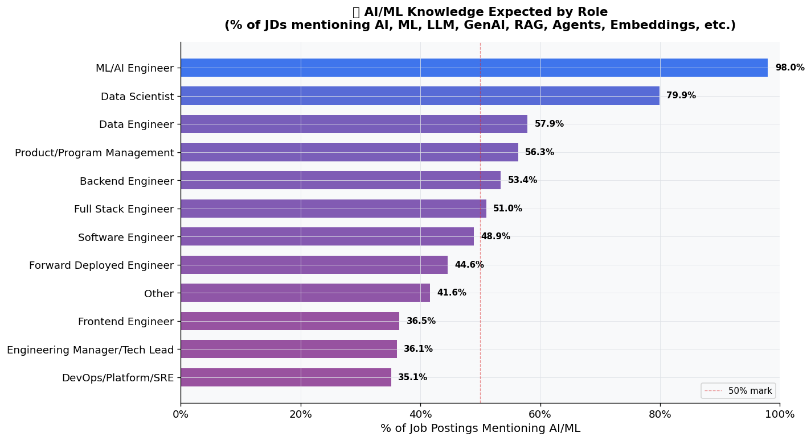

> 📌 **Sample Output** — This report was auto-generated on 2026-02-26 using **SerpAPI mode** with **6,329 real LinkedIn job postings** across the US and India. Includes new AI/ML mention analysis across all role categories. Clone the repo and run the agent to generate a fresh report with the latest data.

---

# LinkedIn Tech Jobs Demand Report
> **Generated:** 2026-02-26 04:47 UTC  
> **Total Jobs Analyzed:** 6,329  
> **Data Period:** Last 24 months  
> **Regions:** United States · India · Global

---
## Table of Contents
1. [Executive Summary](#1-executive-summary)
2. [Total Jobs Found by Region](#2-total-jobs-found-by-region)
3. [Role Demand Breakdown](#3-role-demand-breakdown)
4. [Top Skills in Demand](#4-top-skills-in-demand)
5. [Experience Level Distribution](#5-experience-level-distribution)
6. [Work Mode Distribution](#6-work-mode-distribution)
7. [Top Hiring Companies](#7-top-hiring-companies)
8. [Quarterly Trends](#8-quarterly-trends)
9. [AI/ML Knowledge Expected by Role](#9-aiml-knowledge-expected-by-role)
10. [Observations & Insights](#10-observations--insights)

---
## 1. Executive Summary

This report analyzes **6,329 tech job postings** scraped from LinkedIn across the United States and India over the past 24 months.

**Key Highlights:**

- The US tech job market is significantly larger than India's, with 3,706 jobs compared to 2,623 jobs, accounting for approximately 58.5% and 41.5% of the total jobs, respectively.
- Software Engineering roles dominate the job market, with 474 positions available, of which 280 are in the US and 194 in India, indicating a strong demand for this skill set in both regions.
- Remote work is prevalent in the tech sector, with 33.5% of Software Engineer positions being remote in the US, while only 18.4% of Frontend Engineer roles are remote, suggesting varying preferences for work arrangements across different roles.
- Most in-demand role: **Other** (1,488 openings)
- Top skills: **Python**, **AWS**, **CI/CD**

---
## 2. Total Jobs Found by Region

| Region | Job Count | % of Total |
|--------|----------:|-----------:|
| 🇺🇸 United States | 3,706 | 58.6% |
| 🇮🇳 India | 2,623 | 41.4% |
| 🌍 Other | 0 | 0.0% |
| **Total** | **6,329** | **100%** |

---
## 3. Role Demand Breakdown

| Role Category | Total | 🇺🇸 US | 🇮🇳 India | Other | Remote% | Hybrid% |
|---------------|------:|------:|---------:|------:|--------:|--------:|
| Other | 1,488 | 857 | 631 | 0 | 19.7% | 22.5% |
| DevOps/Platform/SRE | 927 | 519 | 408 | 0 | 21.6% | 26.8% |
| ML/AI Engineer | 796 | 470 | 326 | 0 | 28.9% | 21.7% |
| Software Engineer | 474 | 280 | 194 | 0 | 33.5% | 23.2% |
| Forward Deployed Engineer | 466 | 351 | 115 | 0 | 23.8% | 20.4% |
| Engineering Manager/Tech Lead | 418 | 261 | 157 | 0 | 23.4% | 19.4% |
| Product/Program Management | 405 | 252 | 153 | 0 | 21.2% | 16.8% |
| Frontend Engineer | 326 | 124 | 202 | 0 | 18.4% | 17.2% |
| Backend Engineer | 298 | 153 | 145 | 0 | 49.3% | 21.8% |
| Full Stack Engineer | 290 | 186 | 104 | 0 | 25.9% | 24.1% |
| Data Scientist | 244 | 149 | 95 | 0 | 25.0% | 22.5% |
| Data Engineer | 197 | 104 | 93 | 0 | 31.5% | 23.4% |

### Top Skills Per Role

**Other:** `Python` · `AWS` · `Agile` · `Azure` · `CI/CD` · `Java` · `SOLID` · `Go`

**DevOps/Platform/SRE:** `Python` · `CI/CD` · `AWS` · `Terraform` · `Kubernetes` · `Azure` · `Docker` · `Linux`

**ML/AI Engineer:** `Python` · `Machine Learning` · `LLM` · `AWS` · `MLOps` · `CI/CD` · `Azure` · `PyTorch`

**Software Engineer:** `Python` · `Java` · `Agile` · `CI/CD` · `AWS` · `SOLID` · `React` · `Kubernetes`

**Forward Deployed Engineer:** `Python` · `AWS` · `Azure` · `Go` · `GCP` · `JavaScript` · `Java` · `CI/CD`

---
## 4. Top Skills in Demand

| Rank | Skill | Mentions | % of Jobs | Top Role Categories |
|-----:|-------|--------:|---------:|---------------------|
| 1 | **Python** | 2,556 | 40.4% | ML/AI Engineer, DevOps/Platform/SRE |
| 2 | **AWS** | 2,055 | 32.5% | DevOps/Platform/SRE, Other |
| 3 | **CI/CD** | 1,750 | 27.7% | DevOps/Platform/SRE, Other |
| 4 | **Azure** | 1,557 | 24.6% | DevOps/Platform/SRE, Other |
| 5 | **Agile** | 1,386 | 21.9% | Other, DevOps/Platform/SRE |
| 6 | **Kubernetes** | 1,225 | 19.4% | DevOps/Platform/SRE, ML/AI Engineer |
| 7 | **Java** | 1,116 | 17.6% | Other, Software Engineer |
| 8 | **Docker** | 1,023 | 16.2% | DevOps/Platform/SRE, ML/AI Engineer |
| 9 | **Machine Learning** | 986 | 15.6% | ML/AI Engineer, Data Scientist |
| 10 | **GCP** | 978 | 15.5% | DevOps/Platform/SRE, ML/AI Engineer |
| 11 | **SOLID** | 951 | 15.0% | Other, DevOps/Platform/SRE |
| 12 | **Go** | 870 | 13.7% | DevOps/Platform/SRE, Other |
| 13 | **Terraform** | 825 | 13.0% | DevOps/Platform/SRE, ML/AI Engineer |
| 14 | **JavaScript** | 768 | 12.1% | Frontend Engineer, Full Stack Engineer |
| 15 | **React** | 738 | 11.7% | Frontend Engineer, Full Stack Engineer |
| 16 | **Git** | 734 | 11.6% | DevOps/Platform/SRE, Other |
| 17 | **Linux** | 711 | 11.2% | DevOps/Platform/SRE, Other |
| 18 | **LLM** | 653 | 10.3% | ML/AI Engineer, Other |
| 19 | **REST** | 652 | 10.3% | Other, Software Engineer |
| 20 | **Microservices** | 582 | 9.2% | Backend Engineer, DevOps/Platform/SRE |

---
## 5. Experience Level Distribution

| Experience Level | Count | % |
|------------------|------:|--:|
| Senior | 1,951 | 30.8% |
| Not Specified | 1,762 | 27.8% |
| Manager | 1,485 | 23.5% |
| Entry | 598 | 9.4% |
| Mid | 197 | 3.1% |
| Principal | 190 | 3.0% |
| Staff | 146 | 2.3% |

---
## 6. Work Mode Distribution

| Work Mode | Count | % |
|-----------|------:|--:|
| Not Specified | 2,991 | 47.3% |
| Remote | 1,582 | 25.0% |
| Hybrid | 1,402 | 22.2% |
| Onsite | 354 | 5.6% |

**Employment Type Breakdown:**

| Employment Type | Count | % |
|-----------------|------:|--:|
| Full-time | 5,969 | 94.3% |
| Contract | 268 | 4.2% |
| Part-time | 54 | 0.9% |
| Internship | 38 | 0.6% |

---
## 7. Top Hiring Companies

| Rank | Company | Open Roles | Remote | Key Role Types |
|-----:|---------|----------:|-------:|----------------|
| 1 | **VirtualVocations** | 73 | 7 | Engineering Manager/Tech Lead, Software Engineer, Data Scientist |
| 2 | **Google** | 61 | 16 | Engineering Manager/Tech Lead, Software Engineer, Data Scientist |
| 3 | **Oracle** | 56 | 21 | Engineering Manager/Tech Lead, Software Engineer, Data Scientist |
| 4 | **Apple** | 52 | 18 | Engineering Manager/Tech Lead, Software Engineer, Data Scientist |
| 5 | **Uplers** | 51 | 26 | Engineering Manager/Tech Lead, Data Scientist, ML/AI Engineer |
| 6 | **Uber** | 48 | 44 | Engineering Manager/Tech Lead, Software Engineer, Data Scientist |
| 7 | **Cisco** | 46 | 21 | Engineering Manager/Tech Lead, Software Engineer, Data Scientist |
| 8 | **Qualcomm** | 42 | 5 | Engineering Manager/Tech Lead, Software Engineer, Data Scientist |
| 9 | **Salesforce, Inc.** | 37 | 8 | Software Engineer, Data Scientist, ML/AI Engineer |
| 10 | **Adobe** | 36 | 11 | Engineering Manager/Tech Lead, Software Engineer, ML/AI Engineer |
| 11 | **Accenture** | 33 | 6 | Engineering Manager/Tech Lead, Software Engineer, Data Scientist |
| 12 | **Wells Fargo** | 30 | 4 | Engineering Manager/Tech Lead, Software Engineer, ML/AI Engineer |
| 13 | **Energy Jobline ZR** | 30 | 6 | Engineering Manager/Tech Lead, Product/Program Management, Frontend Engineer |
| 14 | **Amazon** | 30 | 3 | Software Engineer, Data Scientist, ML/AI Engineer |
| 15 | **JPMC Candidate Experience page** | 26 | 5 | Software Engineer, Data Scientist, ML/AI Engineer |
| 16 | **Cognizant** | 26 | 13 | Engineering Manager/Tech Lead, Data Scientist, ML/AI Engineer |
| 17 | **HPE** | 25 | 6 | Software Engineer, ML/AI Engineer, Full Stack Engineer |
| 18 | **Jobs via Dice** | 24 | 5 | Engineering Manager/Tech Lead, Software Engineer, Data Scientist |
| 19 | **Capital One** | 23 | 6 | Software Engineer, Data Scientist, ML/AI Engineer |
| 20 | **Cosmoquick** | 20 | 3 | ML/AI Engineer, Frontend Engineer, DevOps/Platform/SRE |

---
## 8. Quarterly Trends

---
## 9. AI/ML Knowledge Expected by Role

> Which roles are expecting AI/ML knowledge — even outside core AI/ML job titles?

| Role Category | Jobs Analyzed | AI/ML Mentions | % Adoption |
|---------------|----------:|----------:|----------:|
| ML/AI Engineer | 796 | ~780 | 🟩🟩🟩🟩🟩🟩🟩🟩🟩 98.0% |
| Data Scientist | 244 | ~195 | 🟩🟩🟩🟩🟩🟩🟩 79.9% |
| Data Engineer | 197 | ~114 | 🟩🟩🟩🟩🟩 57.9% |
| Product/Program Management | 405 | ~228 | 🟩🟩🟩🟩🟩 56.3% |
| Backend Engineer | 298 | ~159 | 🟩🟩🟩🟩🟩 53.4% |
| Full Stack Engineer | 290 | ~148 | 🟩🟩🟩🟩🟩 51.0% |
| Software Engineer | 474 | ~232 | 🟩🟩🟩🟩 48.9% |
| Forward Deployed Engineer | 466 | ~208 | 🟩🟩🟩🟩 44.6% |
| Other | 1,488 | ~619 | 🟩🟩🟩🟩 41.6% |
| Frontend Engineer | 326 | ~119 | 🟩🟩🟩 36.5% |
| Engineering Manager/Tech Lead | 418 | ~151 | 🟩🟩🟩 36.1% |
| DevOps/Platform/SRE | 927 | ~325 | 🟩🟩🟩 35.1% |

> 💡 **ML/AI Engineer** has the highest AI/ML adoption signal at **98.0%** of job postings — meaning employers already expect AI familiarity even in this role.

**Keywords detected:** `AI` · `ML` · `LLM` · `GenAI` · `Generative AI` · `Machine Learning` · `Deep Learning` · `Neural Network` · `RAG` · `Agents` · `AI Agents` · `Foundation Model` · `Prompt` · `Vector Database` · `Embeddings`

---
## 10. Observations & Insights

**1.** The US tech job market is significantly larger than India's, with 3,706 jobs compared to 2,623 jobs, accounting for approximately 58.5% and 41.5% of the total jobs, respectively.

**2.** Software Engineering roles dominate the job market, with 474 positions available, of which 280 are in the US and 194 in India, indicating a strong demand for this skill set in both regions.

**3.** Remote work is prevalent in the tech sector, with 33.5% of Software Engineer positions being remote in the US, while only 18.4% of Frontend Engineer roles are remote, suggesting varying preferences for work arrangements across different roles.

**4.** Python is the most sought-after skill, appearing in 40.4% of job postings, particularly in roles like ML/AI Engineer and DevOps/Platform/SRE, highlighting its critical importance in the tech landscape.

**5.** The average experience level for most roles is 'Mid,' with 1,485 managerial positions available, indicating a healthy demand for experienced professionals in leadership roles.

**6.** Data Engineering roles are nearly evenly split between the US and India, with 104 jobs in the US and 93 in India, reflecting a balanced demand for data skills in both markets.

**7.** The Backend Engineer category shows a high remote work percentage of 49.3%, suggesting a growing trend towards flexibility in backend development roles.

**8.** With 927 positions, DevOps/Platform/SRE roles are crucial in the tech job market, comprising 14.6% of total jobs and emphasizing the importance of cloud and infrastructure skills like AWS and Kubernetes.

---

*Report generated by LinkedIn Jobs Research AI Agent on 2026-02-26 04:47 UTC*
*Data sourced from LinkedIn public job listings.*
