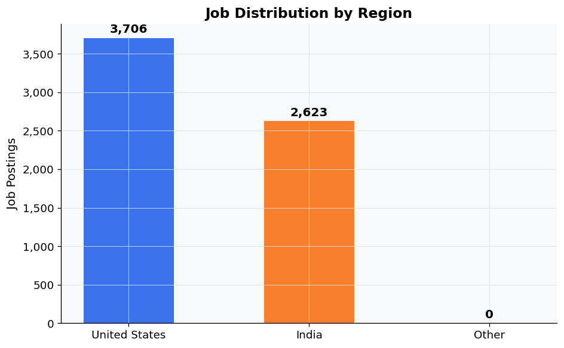
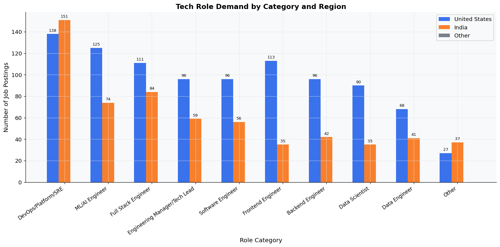
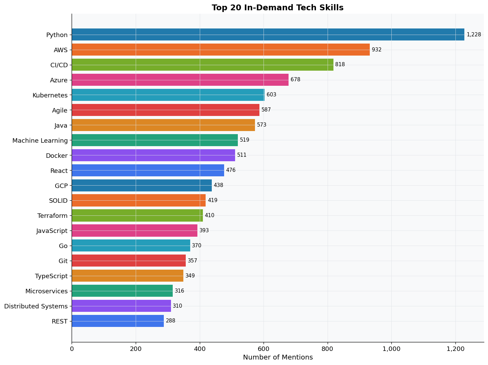
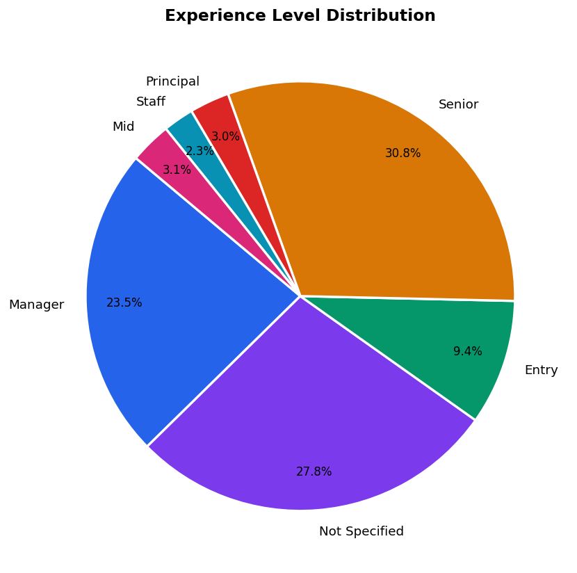
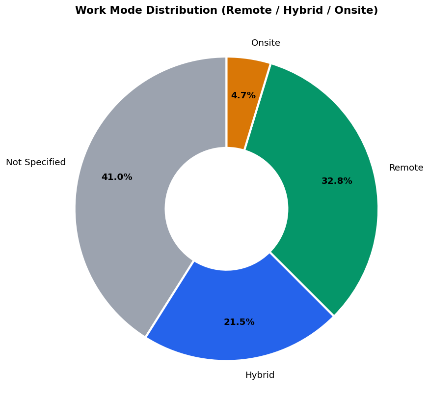
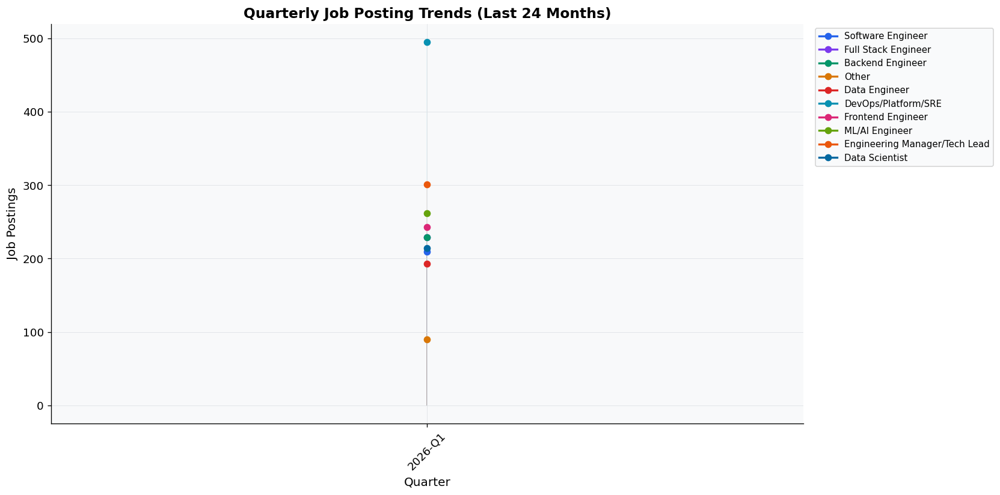

> 📌 **Sample Output** — This report was auto-generated on 2026-02-25 using **SerpAPI mode** with **2,465 real LinkedIn job postings** across the US and India. Clone the repo and run the agent to generate a fresh report with the latest data.

---

# LinkedIn Tech Jobs Demand Report
> **Generated:** 2026-02-25 14:39 UTC  
> **Total Jobs Analyzed:** 2,465  
> **Data Period:** Last 24 months  
> **Regions:** United States · India · Global

---
## Table of Contents
1. [Executive Summary](#1-executive-summary)
2. [Total Jobs Found by Region](#2-total-jobs-found-by-region)
3. [Role Demand Breakdown](#3-role-demand-breakdown)
4. [Top Skills in Demand](#4-top-skills-in-demand)
5. [Experience Level Distribution](#5-experience-level-distribution)
6. [Work Mode Distribution](#6-work-mode-distribution)
7. [Top Hiring Companies](#7-top-hiring-companies)
8. [Quarterly Trends](#8-quarterly-trends)
9. [Observations & Insights](#9-observations--insights)

---
## 1. Executive Summary

This report analyzes **2,465 tech job postings** scraped from LinkedIn across the United States and India over the past 24 months.

**Key Highlights:**

- The US tech job market comprises 58.1% of the total jobs, with 1,434 positions available compared to India's 1,031 jobs, indicating a stronger demand for tech talent in the US.
- Software Engineers are the most sought-after role, with 209 total positions, of which 127 are in the US and 82 in India, highlighting the global demand for this skill set.
- Remote work is more prevalent among Backend Engineers, with 54.6% of positions offering remote options, while Software Engineers have a remote work percentage of 36.4%.
- Most in-demand role: **DevOps/Platform/SRE** (495 openings)
- Top skills: **Python**, **AWS**, **CI/CD**

---
## 2. Total Jobs Found by Region

| Region | Job Count | % of Total |
|--------|----------:|-----------:|
| 🇺🇸 United States | 1,434 | 58.2% |
| 🇮🇳 India | 1,031 | 41.8% |
| 🌍 Other | 0 | 0.0% |
| **Total** | **2,465** | **100%** |

---
## 3. Role Demand Breakdown

| Role Category | Total | 🇺🇸 US | 🇮🇳 India | Other | Remote% | Hybrid% |
|---------------|------:|------:|---------:|------:|--------:|--------:|
| DevOps/Platform/SRE | 495 | 273 | 222 | 0 | 24.6% | 26.5% |
| Engineering Manager/Tech Lead | 301 | 182 | 119 | 0 | 29.2% | 17.9% |
| ML/AI Engineer | 262 | 152 | 110 | 0 | 30.5% | 23.7% |
| Frontend Engineer | 243 | 171 | 72 | 0 | 26.7% | 20.2% |
| Full Stack Engineer | 229 | 98 | 131 | 0 | 36.7% | 16.6% |
| Backend Engineer | 229 | 128 | 101 | 0 | 54.6% | 19.2% |
| Data Scientist | 214 | 146 | 68 | 0 | 23.4% | 24.3% |
| Software Engineer | 209 | 127 | 82 | 0 | 36.4% | 23.4% |
| Data Engineer | 193 | 117 | 76 | 0 | 32.6% | 22.8% |
| Other | 90 | 40 | 50 | 0 | 18.9% | 16.7% |

### Top Skills Per Role

**DevOps/Platform/SRE:** `CI/CD` · `Python` · `AWS` · `Kubernetes` · `Terraform` · `Azure` · `Docker` · `Ansible`

**Engineering Manager/Tech Lead:** `AWS` · `Agile` · `CI/CD` · `Azure` · `Python` · `Java` · `Go` · `SOLID`

**ML/AI Engineer:** `Python` · `Machine Learning` · `PyTorch` · `AWS` · `TensorFlow` · `LLM` · `Azure` · `RAG`

**Frontend Engineer:** `React` · `TypeScript` · `JavaScript` · `CSS` · `HTML` · `Agile` · `Git` · `CI/CD`

**Full Stack Engineer:** `React` · `JavaScript` · `AWS` · `Java` · `Agile` · `TypeScript` · `CI/CD` · `Python`

---
## 4. Top Skills in Demand

| Rank | Skill | Mentions | % of Jobs | Top Role Categories |
|-----:|-------|--------:|---------:|---------------------|
| 1 | **Python** | 1,228 | 49.8% | DevOps/Platform/SRE, ML/AI Engineer |
| 2 | **AWS** | 932 | 37.8% | DevOps/Platform/SRE, Backend Engineer |
| 3 | **CI/CD** | 818 | 33.2% | DevOps/Platform/SRE, Full Stack Engineer |
| 4 | **Azure** | 678 | 27.5% | DevOps/Platform/SRE, Data Engineer |
| 5 | **Kubernetes** | 603 | 24.5% | DevOps/Platform/SRE, Backend Engineer |
| 6 | **Agile** | 587 | 23.8% | DevOps/Platform/SRE, Full Stack Engineer |
| 7 | **Java** | 573 | 23.2% | Backend Engineer, Full Stack Engineer |
| 8 | **Machine Learning** | 519 | 21.1% | ML/AI Engineer, Data Scientist |
| 9 | **Docker** | 511 | 20.7% | DevOps/Platform/SRE, Full Stack Engineer |
| 10 | **React** | 476 | 19.3% | Frontend Engineer, Full Stack Engineer |
| 11 | **GCP** | 438 | 17.8% | DevOps/Platform/SRE, ML/AI Engineer |
| 12 | **SOLID** | 419 | 17.0% | DevOps/Platform/SRE, Full Stack Engineer |
| 13 | **Terraform** | 410 | 16.6% | DevOps/Platform/SRE, Data Engineer |
| 14 | **JavaScript** | 393 | 15.9% | Frontend Engineer, Full Stack Engineer |
| 15 | **Go** | 370 | 15.0% | DevOps/Platform/SRE, Backend Engineer |
| 16 | **Git** | 357 | 14.5% | DevOps/Platform/SRE, Full Stack Engineer |
| 17 | **TypeScript** | 349 | 14.2% | Frontend Engineer, Full Stack Engineer |
| 18 | **Microservices** | 316 | 12.8% | Backend Engineer, Full Stack Engineer |
| 19 | **Distributed Systems** | 310 | 12.6% | Backend Engineer, DevOps/Platform/SRE |
| 20 | **REST** | 288 | 11.7% | Full Stack Engineer, Frontend Engineer |

---
## 5. Experience Level Distribution

| Experience Level | Count | % |
|------------------|------:|--:|
| Senior | 752 | 30.5% |
| Not Specified | 652 | 26.5% |
| Manager | 596 | 24.2% |
| Entry | 275 | 11.2% |
| Principal | 73 | 3.0% |
| Mid | 73 | 3.0% |
| Staff | 44 | 1.8% |

---
## 6. Work Mode Distribution

| Work Mode | Count | % |
|-----------|------:|--:|
| Not Specified | 1,028 | 41.7% |
| Remote | 770 | 31.2% |
| Hybrid | 538 | 21.8% |
| Onsite | 129 | 5.2% |

**Employment Type Breakdown:**

| Employment Type | Count | % |
|-----------------|------:|--:|
| Full-time | 2,318 | 94.0% |
| Contract | 91 | 3.7% |
| Part-time | 33 | 1.3% |
| Internship | 23 | 0.9% |

---
## 7. Top Hiring Companies

| Rank | Company | Open Roles | Remote | Key Role Types |
|-----:|---------|----------:|-------:|----------------|
| 1 | **Uber** | 29 | 28 | Other, Full Stack Engineer, ML/AI Engineer |
| 2 | **Apple** | 29 | 14 | Full Stack Engineer, ML/AI Engineer, Data Scientist |
| 3 | **Cisco** | 22 | 13 | Full Stack Engineer, ML/AI Engineer, DevOps/Platform/SRE |
| 4 | **VirtualVocations** | 21 | 5 | Full Stack Engineer, ML/AI Engineer, Frontend Engineer |
| 5 | **Uplers** | 18 | 10 | Full Stack Engineer, ML/AI Engineer, Data Scientist |
| 6 | **Google** | 16 | 7 | ML/AI Engineer, DevOps/Platform/SRE, Data Scientist |
| 7 | **S&P Global** | 16 | 7 | Full Stack Engineer, ML/AI Engineer, Data Scientist |
| 8 | **Adobe** | 15 | 5 | Other, Full Stack Engineer, ML/AI Engineer |
| 9 | **Barclays** | 14 | 3 | Full Stack Engineer, ML/AI Engineer, Frontend Engineer |
| 10 | **Oracle** | 14 | 7 | DevOps/Platform/SRE, ML/AI Engineer, Data Engineer |
| 11 | **Salesforce, Inc.** | 13 | 3 | Full Stack Engineer, Data Scientist, DevOps/Platform/SRE |
| 12 | **Robert Half** | 13 | 3 | Full Stack Engineer, ML/AI Engineer, DevOps/Platform/SRE |
| 13 | **Cosmoquick** | 12 | 0 | DevOps/Platform/SRE, Frontend Engineer |
| 14 | **Expedia Group** | 12 | 7 | Full Stack Engineer, ML/AI Engineer, Data Scientist |
| 15 | **Mastercard** | 11 | 4 | Full Stack Engineer, Data Scientist, DevOps/Platform/SRE |
| 16 | **eBay** | 11 | 7 | Full Stack Engineer, ML/AI Engineer, Data Scientist |
| 17 | **Wells Fargo** | 10 | 2 | Full Stack Engineer, DevOps/Platform/SRE, Software Engineer |
| 18 | **Capital One** | 10 | 1 | Full Stack Engineer, ML/AI Engineer, Data Scientist |
| 19 | **JPMC Candidate Experience page** | 10 | 0 | Full Stack Engineer, ML/AI Engineer, Data Scientist |
| 20 | **Equifax** | 10 | 3 | Software Engineer, Full Stack Engineer, DevOps/Platform/SRE |

---
## 8. Quarterly Trends

---
## 9. Observations & Insights

**1.** The US tech job market comprises 58.1% of the total jobs, with 1,434 positions available compared to India's 1,031 jobs, indicating a stronger demand for tech talent in the US.

**2.** Software Engineers are the most sought-after role, with 209 total positions, of which 127 are in the US and 82 in India, highlighting the global demand for this skill set.

**3.** Remote work is more prevalent among Backend Engineers, with 54.6% of positions offering remote options, while Software Engineers have a remote work percentage of 36.4%.

**4.** In India, Full Stack Engineers are in higher demand (131 positions) compared to their US counterparts (98 positions), suggesting a growing emphasis on full-stack development skills in the Indian market.

**5.** The top skills across various roles include Python (49.8% of total jobs), AWS (37.8%), and CI/CD (33.2%), indicating a strong preference for cloud and automation skills in both markets.

**6.** Engineering Manager/Tech Lead roles show a significant presence with 301 total positions, split between 182 in the US and 119 in India, reflecting the need for leadership in tech projects.

**7.** Data roles are also prominent, with Data Engineers having 193 positions available, where the US leads with 117 jobs compared to 76 in India, emphasizing the importance of data management skills.

**8.** The experience distribution shows that 752 positions are targeted at Senior-level candidates, indicating a preference for experienced professionals in the tech job market.

---

*Report generated by LinkedIn Jobs Research AI Agent on 2026-02-25 14:39 UTC*
*Data sourced from LinkedIn public job listings.*
